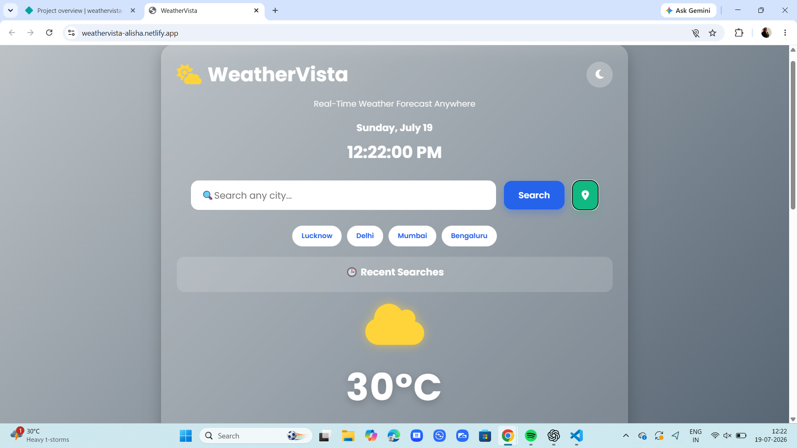
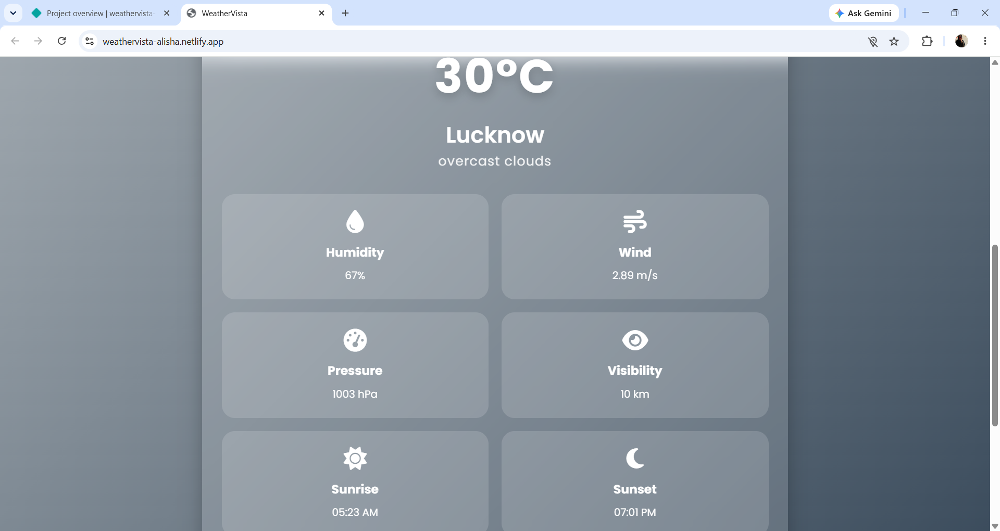
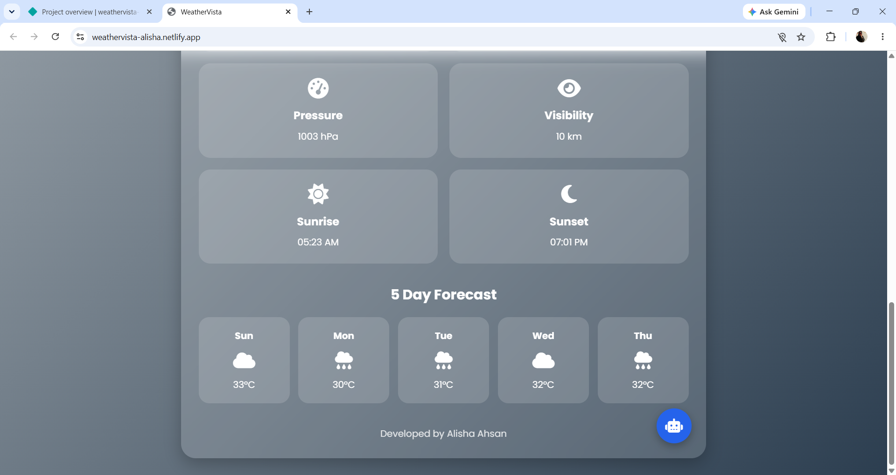
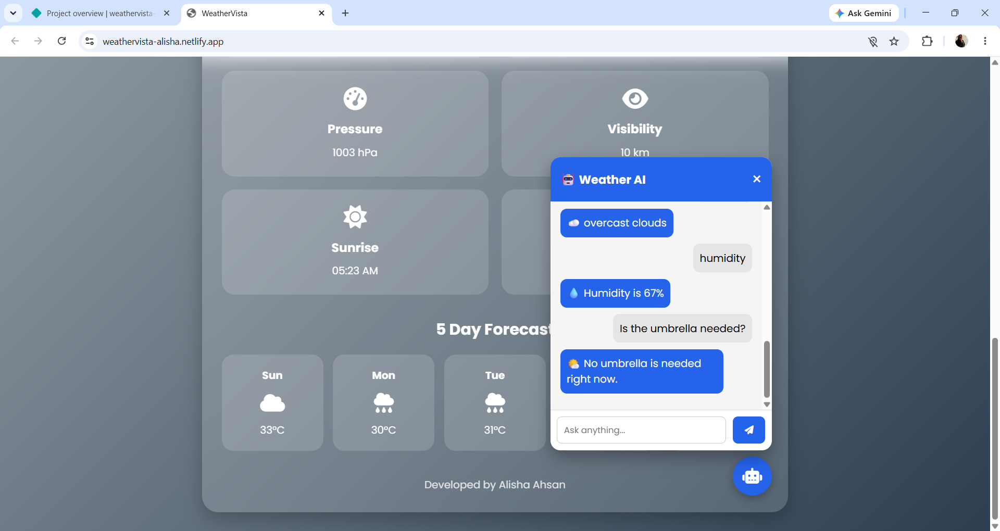

# 🌤️ WeatherVista

WeatherVista is a modern and responsive weather application that provides real-time weather information for any city using the OpenWeather API. It features a beautiful glassmorphism interface, dynamic backgrounds, a 5-day forecast, an AI-style weather assistant chatbot, favorite cities, and search history for an enhanced user experience.

---

## 🚀 Live Demo

**Netlify:**
https://weathervista-alisha.netlify.app/

---

## 📂 GitHub Repository

**Repository:**
https://github.com/Alisha1402/WeatherVista

---

## ✨ Features

* 🔍 Search weather by city name
* 📍 Get weather using current location
* 🌡️ Real-time temperature
* 💧 Humidity
* 🌬️ Wind speed
* 📊 Atmospheric pressure
* 👀 Visibility
* 📅 5-Day Weather Forecast
* 🌅 Sunrise & Sunset Time
* 🤖 AI-style Weather Assistant Chatbot
* ⭐ Favorite Cities
* 🕒 Recent Search History
* 🎨 Dynamic Weather Background
* ☁️ Dynamic Weather Icons
* 📱 Fully Responsive Design
* ✨ Modern Glassmorphism User Interface

---

## 🛠️ Technologies Used

* HTML5
* CSS3
* JavaScript (ES6)
* OpenWeather API
* Font Awesome
* Google Fonts

---

## 📁 Project Structure

```text
WeatherVista/
│── index.html
│── style.css
│── script.js
│── README.md
```

---

## ⚙️ Installation & Usage

1. Clone the repository:

```bash
git clone https://github.com/Alisha1402/WeatherVista.git
```

2. Open the project folder.

3. Run the project using **VS Code Live Server** or any local web server.

---

## 🔑 API

This project uses the **OpenWeather API** to fetch live weather information.

https://openweathermap.org/api

---

## 📸 Screenshots

### 🏠 Home Page


### 🌍 Weather Search (Lucknow)


### 📅 5-Day Forecast


### 🤖 Weather AI Assistant


---

## 🔮 Future Enhancements

* 🌫️ Air Quality Index (AQI)
* 🔔 Weather Alerts
* 🌍 Multi-language Support
* 🎤 Voice Commands
* 📊 Weekly Weather Analytics

---

## 👩‍💻 Developer

**Alisha Ahsan**

* GitHub: https://github.com/Alisha1402
* LinkedIn: https://www.linkedin.com/in/alisha-ahsan-96baba313

---

## 📄 License

This project is developed for educational and learning purposes.

---

⭐ If you like this project, consider giving the repository a star!
